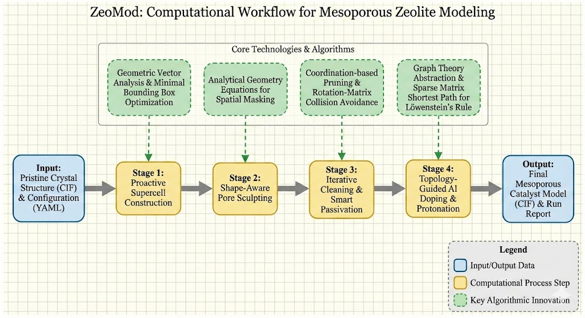

# ZeoMod: Intelligent Mesoporous Zeolite Modeling Framework


<p align="center">




**ZeoMod** 是一个专为计算化学家设计的高性能 Python 工具包，用于自动化构建复杂的介孔沸石分子筛模型。它旨在弥合理想晶体结构 (CIF) 与真实的、功能化的催化剂模型之间的鸿沟。

通过结合几何分析、图论算法和自动化工作流，ZeoMod 能够高效地生成具有特定孔道形状、经过合理钝化且符合物理化学规则（如 Löwenstein 规则）的掺杂结构。

------


## 🌟 核心特性 (Key Features)


- **🧠 智能超胞构建 (Proactive Supercell V3)**:↳
  - 基于输入晶胞的几何特性和目标孔道形状，自动计算所需的最小超胞倍率，在保证包裹孔道的前提下最小化计算成本。
- **📐 形状感知切割 (Shape-Aware Sculpting)**:
  - 支持多种参数化的几何形状切割：球体 (Sphere)、圆柱体 (Cylinder)、立方体/长方体 (Box/Cube)、椭球体 (Ellipsoid)。
  - 支持生成周期性介孔结构或非周期性团簇 (Cluster) 模型。
- **🛡️ 智能清洗与钝化 (Smart Cleaning & Passivation)**:
  - 迭代清理切割后产生的不稳定低配位原子。
  - **防碰撞 H 放置算法**：基于旋转矩阵搜索最佳位置，为悬挂氧添加钝化 H 原子，确保键长、键角合理且无空间位阻。
- **⚛️ 拓扑导向掺杂 (Topology-Guided Doping)**:
  - **严格遵守 Löwenstein 规则**：利用 `matscipy` 和稀疏矩阵计算图拓扑距离，确保在大规模无序超胞中绝对禁止 Al-O-Al 连接。
  - **灵活的掺杂模式**：支持按目标硅铝比 (Si/Al Ratio) 掺杂，或精确指定掺杂 Al 原子的固定数量 (Fixed Count)。
  - 自动为引入的骨架 Al 添加电荷平衡质子 (Brønsted 酸位点)。
- **⚙️ 灵活的工作流控制**:
  - 完整的管道式设计，可通过命令行参数跳过特定阶段（如仅切孔不掺杂，或仅对已有介孔结构进行掺杂）。
  - 支持 "YAML 配置文件 + 命令行参数覆盖" 的混合配置模式，适应批量作业和快速调试。

------


## 📦 安装指南 (Installation)


### 前置要求


- Python 3.8 或更高版本
- 建议在独立的虚拟环境 (conda 或 venv) 中安装。


### 从源码安装 (推荐)


Bash

```
# 1. 克隆仓库
git clone https://github.com/Phorbol/zeomod.git
cd zeomod

# 2. 安装 (使用 -e 模式以便随时更新代码)
pip install -e .
```

安装完成后，`zeomod` 命令将被注册到系统路径中，可在任意目录下直接调用。

------


## 🚀 快速开始 (Quick Start)


### 1. 准备输入文件


在你的工作目录下准备一个纯硅沸石的 CIF 文件（例如 `MFI.cif`）。

> **⚠️ 重要科学提示**：为确保电荷平衡和化学合理性，强烈建议始终从**纯硅 (Pure Silica)** 骨架开始构建。ZeoMod 的设计流程是先在纯硅上切孔钝化，再进行受控掺杂。


### 2. 生成配置文件模板


如果你不知道如何编写配置，可以让 ZeoMod 自动生成一个模板：

Bash

```
zeomod --generate-template
# 这将在当前目录生成一个 template_config.yaml 文件
# 你可以将其重命名为 input.yaml 并进行修改
mv template_config.yaml input.yaml
```


### 3. 运行标准流程


编辑 `input.yaml` 后，运行：

Bash

```
zeomod input.yaml
```

程序将自动执行扩胞、切孔、钝化、掺杂和校验流程，结果保存在 `output/` 目录下。


### 4. 命令行快速覆盖 (CLI Override)


无需修改 YAML 文件，直接通过命令行参数尝试不同的参数组合：

Bash

```
# 快速测试不同孔径的圆柱形孔道
zeomod input.yaml --shape cylinder --axis z --diameter 12.0 --output run_cyl_12

# 强制指定掺杂 4 个 Al 原子，忽略配置文件中的比例
zeomod input.yaml --num-al 4 --output run_fixed_al4
```

------


## 📖 配置参数详解 (Configuration)


配置文件 (`input.yaml`) 支持丰富的参数设定。


### 基础 I/O 与几何


| **参数名**      | **类型** | **默认值** | **说明**                                             |
| --------------- | -------- | ---------- | ---------------------------------------------------- |
| `input_cif`     | str      | "MFI.cif"  | 输入晶体结构路径。                                   |
| `output_dir`    | str      | "output"   | 结果输出目录。                                       |
| `pore_shape`    | str      | "cylinder" | 孔道形状: `sphere`, `cylinder`, `box`, `ellipsoid`。 |
| `pore_diameter` | float    | 10.0       | 主要孔径尺寸 (Å)。                                   |
| `cylinder_axis` | str      | "z"        | 圆柱体沿哪个轴向: `x`, `y`, 或 `z`。                 |
| `pore_buffer`   | float    | 3.0        | 智能扩胞时，孔道边缘到晶胞边界的缓冲距离 (Å)         |
|                 |          |            |                                                      |


### 化学掺杂


| **参数名**          | **类型** | **默认值** | **说明**                                                     |
| ------------------- | -------- | ---------- | ------------------------------------------------------------ |
| `si_al_ratio`       | float    | 30.0       | 目标硅铝比。                                                 |
| `num_al_atoms`      | int      | None       | **[优先]** 显式指定要掺杂的 Al 原子总数。若设置且 >0，则忽略 `si_al_ratio`。 |
| `doping_campaign`   | list     | [...]      | (高级) 定义掺杂位点选择策略的列表，详见模板注释。            |
| `max_doping_trials` | int      | 100        | 寻找满足 Löwenstein 规则位点的最大尝试次数。                 |


### 高级算法参数 (通常无需修改)


可以通过命令行 `--set key=value` 进行覆盖。

| **参数名**                   | **说明**                              |
| ---------------------------- | ------------------------------------- |
| `collision_threshold`        | 骨架原子间的碰撞阈值 (Å)。            |
| `collision_threshold_h`      | H 原子放置时的防碰撞阈值 (Å)。        |
| `rotation_steps_h_placement` | 智能 H 放置时的旋转搜索精度（步数）。 |

------


## 🛠️ 命令行高级用法 (CLI Usage)


zeomod 命令支持三层配置优先级：

命令行 --set > 命令行显式 Flag (--diameter 等) > YAML 配置文件 > 代码默认值


### 流程控制 Flags


用于跳过特定阶段，实现管道式操作：

- `--skip-supercell`: 跳过自动扩胞（假设输入已经是超胞）。
- `--skip-cut`: 跳过切孔和钝化（假设输入已有孔道）。
- `--skip-doping`: 跳过 Al 掺杂（仅生成纯硅介孔）。

**示例：仅生成纯硅介孔结构**

Bash

```
zeomod input.yaml --skip-doping --output pure_silica_meso
```


### 万能覆盖参数 `--set`


用于动态修改任何配置项，包括列表或布尔值。

Bash

```
# 强制设置超胞尺寸，并提高 Löwenstein 重试次数
zeomod input.yaml --set supercell_dims=[3,3,3] max_doping_trials=500
```

------


## 📄 License


This project is licensed under the MIT License - see the [LICENSE](https://www.google.com/search?q=LICENSE) file for details.↳

------


## 👥 Authors & Acknowledgments


- Developed by [Geng Jianrui/XMCAO Group].↳
- Core topology analysis powered by `matscipy` and `scipy.sparse`.↳
- Structure manipulation built upon the `ASE` (Atomic Simulation Environment) library.